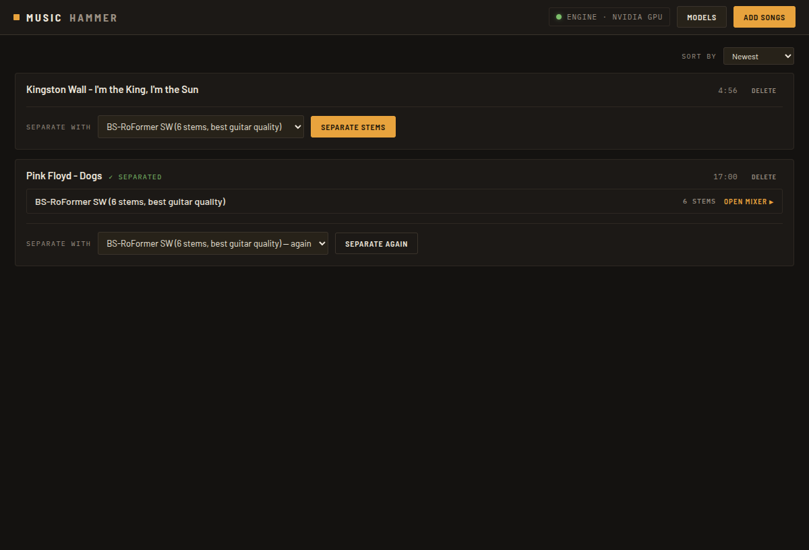
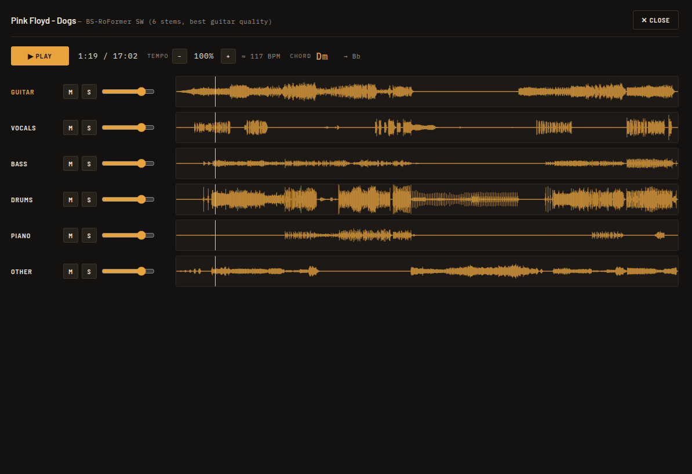

# MusicHammer

Split songs into their parts (guitar, vocals, drums, bass, and more) and practice along with any of them muted or soloed, or remove vocals for karaoke.  Everything runs locally on your own machine: your audio never leaves your computer and the app doesn't send any data anywhere.

Installers for Windows (10/11) and Linux (AppImage / .deb) are on the [Releases](https://github.com/mimrock/musichammer/releases) page. On first launch the app asks before downloading its audio engine (about 1.5 GB, or 3.5 GB with an NVIDIA GPU); separation models (~0.7 GB each) are downloaded on demand from their authors' original repositories, with each model's license shown in the app.

The Windows installer is unsigned, so SmartScreen will warn you the first time — click "More info", then "Run anyway".

To build from source: `./setup.sh cpu` (or `cuda`) on Linux, then `./dev.sh`.

License: MIT.

## Download

[v0.1.1](https://github.com/mimrock/musichammer/releases/tag/v0.1.1) binaries for windows (10/11) and linux (AppImage / .deb)

## Models

Supported stem separator models are:
- Demucs v4
	- Automatically installed on first use
	- Reasonably fast on CPU (~1x the song length)
	- MIT license
	- Acceptable stem separation quality for 6 stems
	
- BS-RoFormer SW
	- Installed manually by clicking on the Download button (667 MiB)
	- Very slow on CPU (5-10x the song length), much quicker on NVIDIA GPU
	- Unknown license (anonymous author)
	- Best stem separation quality for 6 stems
	
- Mel-RoFormer Instrumental
	- Automatically installed on first use
	- Moderate performance on CPU (~2-3x the song length), much quicker on NVIDIA GPU
	- No declared license
	- Only separates 2 stems (vocals, instrumental)
	- Best for karaoke
	
- Mel-RoFormer Guitar
	- Installed manually by clicking on the Download button (43 MiB)
	- Moderate performance on CPU (~2-3x the song length), much quicker on NVIDIA GPU
	- No declared license
	- Only separates 2 stems (guitar, everything else)
	- Guitar separation quality (especially for distorted guitar) is close to BS-RoFormer SW
	
## Screens

 

## Note

This software is in early development. It may eat your computer for lunch if it feels like it. I make no gurantees that it will work for you or is safe to use. Use at your own risk!
